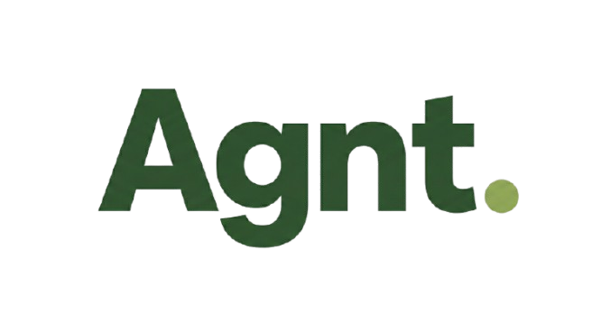

  

# CodeRedProject-FullStack

 Platform to Connect Potential Agents for Hiring: Designing a platform to connect agents and streamline hiring processes.

# Installation

1. Clone the repository
- `git clone https://github.com/Prince-Anand/CodeRedProject-FullStack.git`
2. Install dependencies
- `cd CodeRedProject-FullStack`
- `cd frontend`
- `npm install`
3. Run the development server
- `npm run dev`
4. Access the application at `http://localhost:port` (port will be visible in terminal) - `localhost:port` e.g. `http://localhost:5173`

5. Run the backend server
- `cd backend`
- `npm install`
- `npm run dev`
6. Access the backend at `http://localhost:5000`